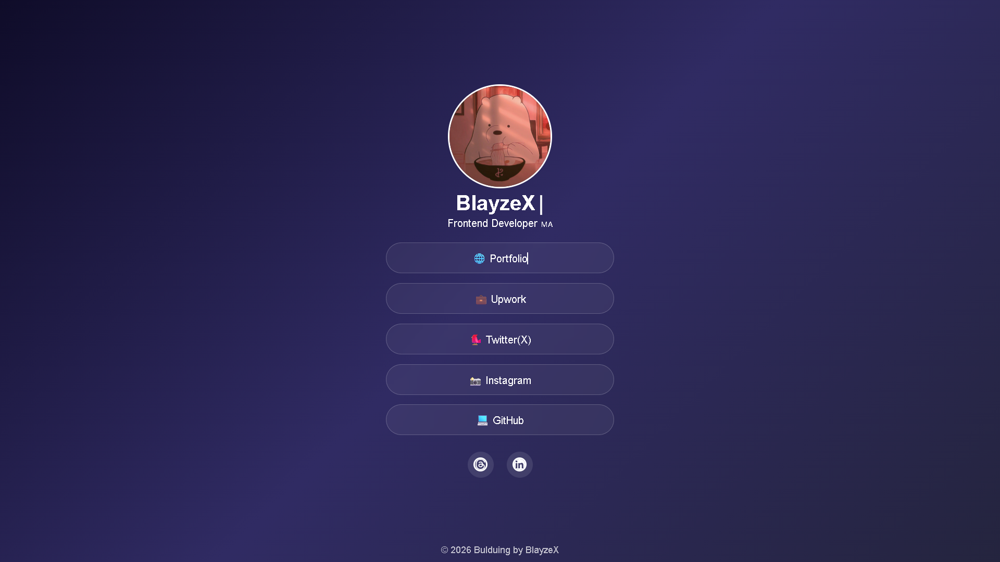

# 📌 Link in Bio Page

A modern **Link in Bio** page built for creators and developers to showcase all their important links in one place.

---

## 🚀 Live Demo
🔗 [Live Demo](https://blayzex.github.io/Link-in-Bio/)

---

## ✨ Features
- Clean modern UI  
- Responsive design (mobile friendly)  
- Smooth hover animations  
- Typing animation effect  
- Social media icons with tooltips  
- Fast and lightweight  

---

## 🛠️ Built With
- HTML5  
- CSS3  
- Vanilla JavaScript  

---

## 📸 Preview

---

## 🎯 Purpose
This project helps content creators and developers easily share all their important links in one place, including:

- Portfolio  
- Social media  
- Freelance platforms  

---

## 💡 Future Improvements
- Dark / Light mode toggle  
- Custom themes per user  
- Click analytics  
- Backend support for dynamic links  

---

## 👨‍💻 Author
Made with ❤️ by **BlayzeX**  
Frontend Developer 🇲🇦

---

## 📄 License
This project is free to use for learning and personal projects.
